# SALES TREND: BIKE PURCHASES

## Overview
This repository tells the story of how customer demographics, lifestyle, and regional differences influence bike purchases.  
It goes beyond numbers, weaving insights into a narrative about **who buys bikes, why they buy them, and how their choices reflect broader social patterns.**

Bike ownership is not just about transport; it reflects culture, affordability, and lifestyle choices. In some regions, bikes are symbols of sustainability and health, while in others they are practical tools for short commutes or affordable alternatives to cars. The dataset reveals how factors like age, income, education, and marital status intersect to shape decisions, showing that bike purchases are deeply tied to life stage and social context.

By analyzing these patterns, the project uncovers how women are reshaping the profile of the typical bike buyer, how middle-aged customers balance financial stability with health awareness, and how regional infrastructure influences adoption. It highlights that bikes are more than products; they are reflections of identity, community, and the way people move through their world. This case study transforms raw data into a story about human behavior, culture, and everyday choices.

---

## Data Journey
### Raw Dataset
The original dataset contained broad customer information:
- Serial Number
- Marital Status
- Gender
- Region
- Education
- Commute Distance
- Income
- Children
- Home Ownership
- Cars
- Age
- Purchased Bike
- Occupation

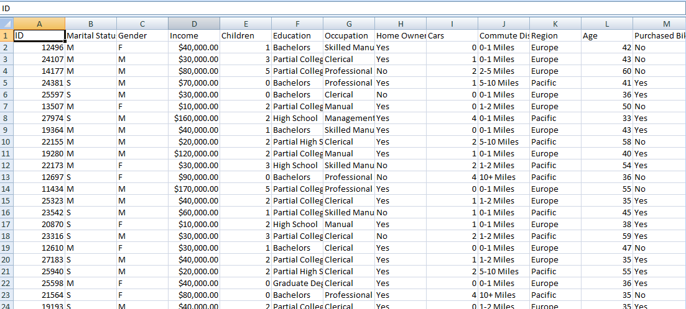

---

### Cleaning Process
The data was carefully cleaned to prepare it for storytelling:
- **Duplicates removed** to ensure unique customer records.  
- **Income column reformatted** from currency to plain numbers, decimals removed for clarity.  
- **Age brackets created** using nested IF statements:  
  - 0–31 → Adolescent  
  - 31–54 → Middle Age  
  - greater than 54 → Old  

This step transformed raw data into a structured foundation for meaningful insights.

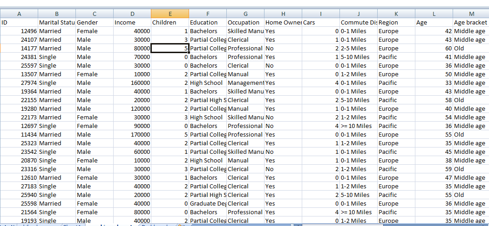

---

## Analysis Story
### Gender and Income
Women emerge as the highest bike purchasers in this dataset.  
This pattern highlights not only purchasing power but also lifestyle choices, where women increasingly view bikes as practical for commuting and empowering for recreation.  
The trend suggests that female riders are driving demand more strongly than men, reshaping the profile of the typical bike buyer.  

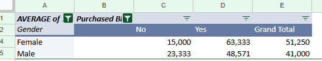

### Commute Distance
Short‑distance commuters (0–1 miles) remain strong bike buyers, valuing convenience for quick trips.  
However, the highest enthusiasm comes from those traveling 5–10 miles, showing that bikes are a preferred option for mid‑range journeys.  
Meanwhile, commuters in the 2–5 mile range are the least likely to purchase, suggesting that this group leans more toward cars or public transport.  

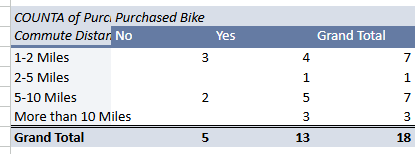

### Age Brackets
Middle Age customers dominate bike purchases.  
This group balances financial stability with health awareness, making bikes both affordable and desirable.  
Older adults follow, while adolescents purchase the least, reflecting limited independence or resources.  

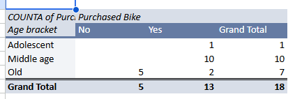

---

## Dashboard Story
The dashboards bring these insights together with interactive filters:

### General Dashboard

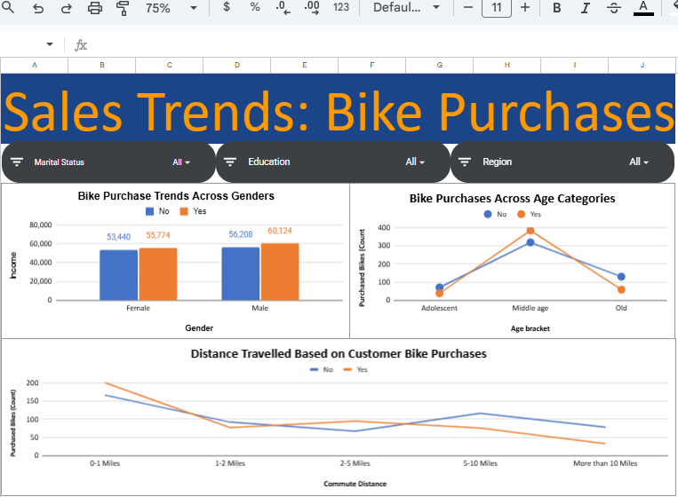

**Key finding:** The general dashboard provides a broad overview of purchasing behavior. It highlights how age, income, and commute distance intersect, showing that middle-aged customers with moderate incomes are the most consistent buyers. It also reveals that cultural and lifestyle differences across regions strongly shape bike ownership patterns.

---

### Graduate Degree, Single Customers
- **North America**:
  
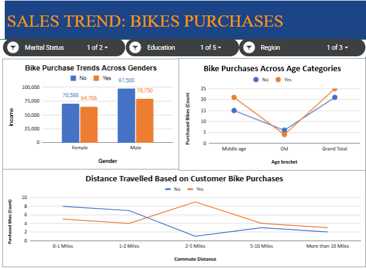  

**Key finding:** Middle-aged men commuting 2–5 miles dominate purchases. This reflects bikes as practical urban tools, chosen for efficiency in cities where distances are manageable. It also suggests that education and lifestyle combine to make cycling a rational choice for this group.  

- **Europe**:
  
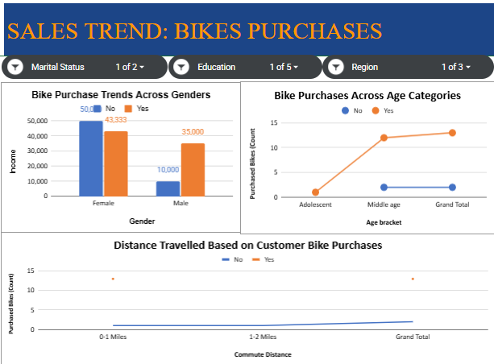  

**Key finding:** Middle-aged women with 0–1 mile commutes lead. Europe’s compact city design makes bikes ideal for short trips, and cultural emphasis on sustainability reinforces this choice. The data shows how education and gender intersect to shape commuting habits.  

- **Pacific**:
  
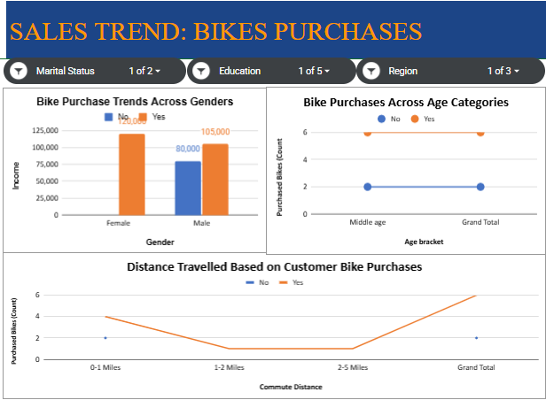 

**Key finding:** Mirrors Europe, with women and short commutes driving purchases. Here, affordability and lifestyle blend, showing bikes as both practical and culturally embraced. This highlights how regional infrastructure and social norms influence ownership.  

---

### High School Graduates

- **Pacific**:
  
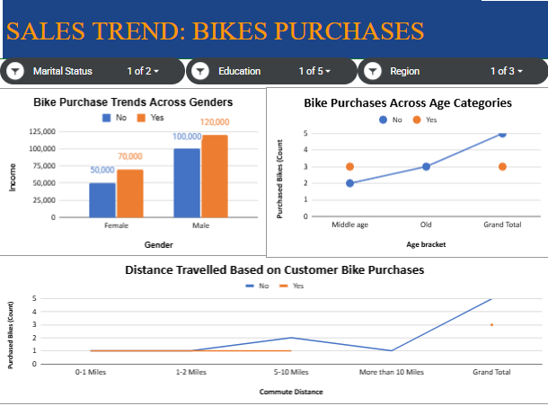  

**Key finding:** Single males dominate purchases, driven by affordability. Bikes represent accessible mobility without the financial burden of cars. This underscores how education level and income constraints shape transport decisions.  

- **North America**:
  
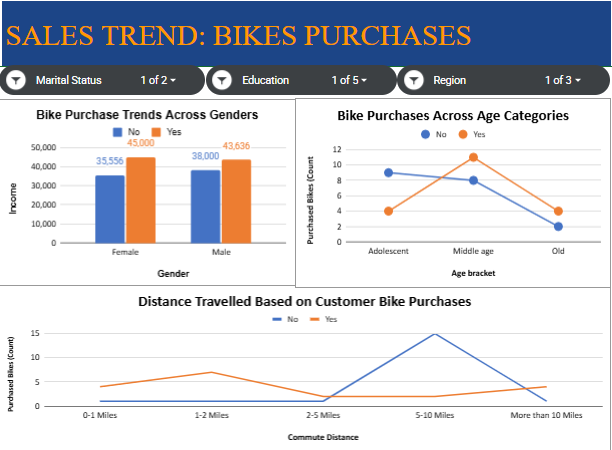  

**Key finding:** Single females dominate, but 5–10 mile commuters show the lowest purchases. Longer distances discourage bike ownership, pointing to reliance on cars or public transport. This reflects how geography and infrastructure limit cycling adoption.  

- **Europe**:
  
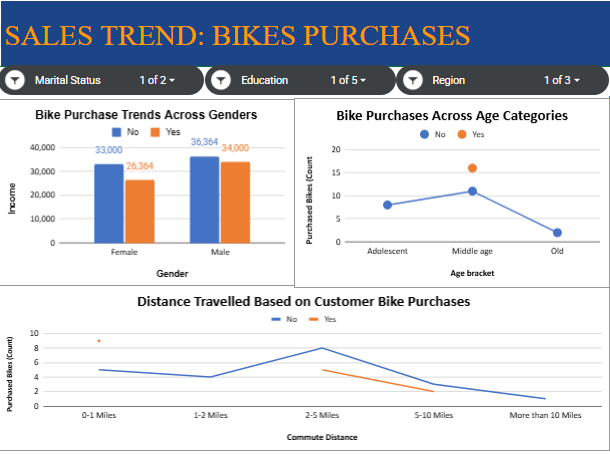  

**Key finding:** Middle-aged males with 0–1 mile commutes lead. Bikes here are practical short-trip solutions, supported by Europe’s cycling-friendly infrastructure. The data shows how cultural norms and city design encourage bike use even among less-educated groups.  

---

### Married Customers (Graduate Degree)

- **Europe**:
  
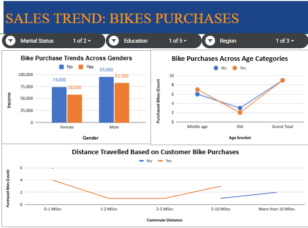 

**Key finding:** Married men dominate, especially in 0–1 mile commutes. Older age groups buy the least, suggesting lifestyle shifts away from cycling as responsibilities grow. This highlights how family status influences transport choices.  

- **North America**:
   
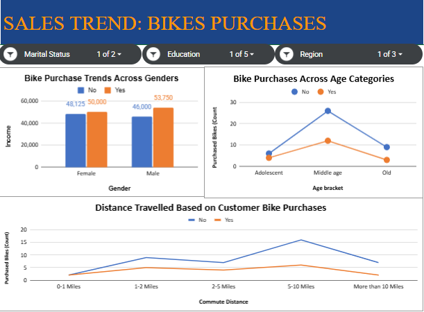  

**Key finding:** Married customers show the highest “No” purchases among 5–10 mile commuters. Yet middle-aged buyers stand out, balancing family life with practical transport needs. This reveals how distance and lifestyle pressures reduce bike adoption.  

- **Pacific**:
  
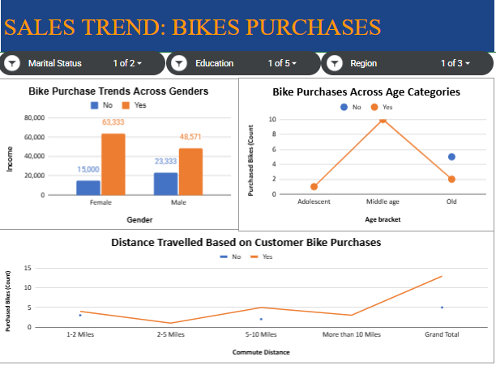 

**Key finding:** Married women lead, with 5–10 miles and middle age being the strongest categories. Bikes here are embraced as family-friendly, affordable, and health-conscious choices. This reflects how cultural attitudes toward wellness and affordability drive ownership.  

---

## Behavioral Patterns
- **Culture shapes choices**: Europe’s compact cities favor short commutes, making bikes the natural choice for everyday mobility. The data shows that cycling is not just transport but part of the cultural fabric, supported by infrastructure like bike lanes and public policies. In North America, spread-out cities encourage mid-range trips, but longer distances often push people toward cars, highlighting how geography limits bike adoption. The Pacific blends affordability and lifestyle, where bikes are embraced both as practical transport and as symbols of health and community, showing how culture and economics intersect.  

- **Education influences priorities**: Graduate degree holders often reflect lifestyle and cultural differences, choosing bikes as symbols of sustainability, independence, and health. Their purchasing behavior shows how education can shape values beyond income, with choices tied to environmental awareness and wellness. High school graduates, on the other hand, highlight affordability and necessity, showing that bikes are chosen when they are the most accessible option. This contrast reveals how education level influences whether bikes are seen as lifestyle enhancements or essential tools for mobility.  

- **Marital status changes the story**: Singles lean toward practicality, often choosing bikes for independence, cost savings, and flexibility in commuting. Married customers reveal lifestyle-driven differences, with women in the Pacific leading purchases and men in Europe dominating short commutes, reflecting cultural expectations around family and gender roles. The data shows that family responsibilities and household dynamics influence transport decisions, with married buyers often balancing practicality with lifestyle aspirations. This demonstrates how personal life stage and social context shape whether bikes are adopted as everyday transport or sidelined for other priorities.  


---

## Tools & Technologies
- **Google Sheets**: For dashboard creation and interactive filters.  
- **Excel**: Initial analysis.    
- **GitHub**: For version control and project documentation.  

---

## Project Learnings
- Cleaning data is not just technical; it’s about making insights **clear and accessible**.  
- PivotTables are powerful storytelling tools when paired with **narrative explanations**.  
- Dashboards reveal **hidden cultural and lifestyle patterns** when filters are applied thoughtfully.  
- Visual storytelling transforms a dataset into a **portfolio-worthy case study**.  

---

## Author
**Blessing**  
Data Analyst | Medical Laboratory Scientist | Virtual Assistant

---

## Contact
- **LinkedIn:** [linkedin.com/in/blessing](https://www.linkedin.com/in/blessing-nwokike/)   
Feel free to connect for collaborations, data storytelling projects, or professional opportunities.

---

## How to Use

To explore this project locally:

1. **Clone the repository**  
   ```bash
   git clone https://github.com/Blessing-Chinaza/-SALES-TREND-BIKE-PURCHASES-.git

